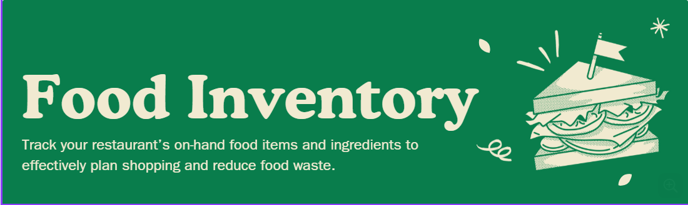

<p align="center">
  
</p>


# 🛒 Inventory Management System (Phase 1)

A console-based Java program simulating a grocery inventory system using **OOP principles**, **arrays of objects**, and **method overloading**.

---

## 🧠 Overview
This project manages a grocery store’s stock through the console.  
It allows adding, updating, and viewing products by name or brand, showcasing **encapsulation**, **composition**, and **data abstraction** in Java.

---

## 🛠️ Tech Stack
- Java (JDK 8 or later)  
- Standard I/O

---

## ✨ Features
- Add new inventory items  
- Support for both branded and unbranded products  
- Update product price or quantity  
- Generate detailed stock reports  
- Handle duplicate or missing items with warnings  
- Compare items by price  

---

## 📸 Sample Output
```text
bread: 15 units @ 9.99
al-jebrini milk: 2 units @ 2.00
eggs: 3 units @ 1.50
Warning: bread already in stock
Updated milk price by 25%
````

---

## ⚙️ Installation

```text
git clone https://github.com/abdallahabed/uni-java-inventory-phase1.git
cd uni-java-inventory-phase1/src
javac *.java
java java2_Phase1.InventoryDriver
```

---

## 🧪 Usage

```text
Run the program to test inventory operations:
- Add new items
- Update price or quantity
- Display stock report
- Compare item prices
```

---

## 🧩 What I Learned

```text
Applied OOP principles: composition, encapsulation, and overloading
Practiced data organization with custom classes
Improved error handling and console output formatting
Strengthened Java fundamentals for Phase 2 (GUI + File I/O)
```

---

## 🏷️ Project Details

```text
Course: Object-Oriented Programming (Java)
Semester: Fall 2025
```

```

---

